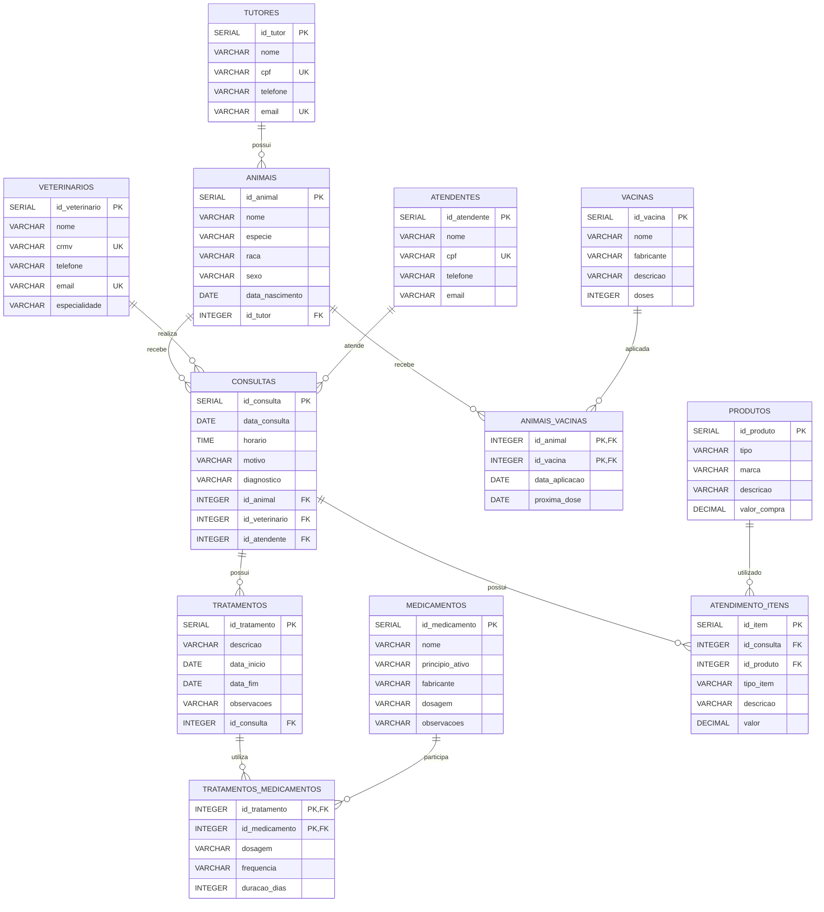

# Cuidados Veterinários

## 📌 Apresentação do Projeto

O projeto **Cuidados Veterinários** consiste no desenvolvimento de um banco de dados relacional para auxiliar no gerenciamento das informações de uma clínica veterinária.

O sistema foi desenvolvido para organizar e armazenar informações sobre tutores, animais, veterinários, consultas, tratamentos, medicamentos, vacinas, atendentes e produtos, facilitando o controle dos atendimentos e do histórico dos animais.

## 🎯 Objetivo Geral

Desenvolver um banco de dados relacional utilizando **PostgreSQL** para gerenciar as informações de uma clínica veterinária, permitindo o cadastro e o controle de animais, seus respectivos tutores, veterinários, consultas, tratamentos, medicamentos, vacinações, atendentes e produtos.

## 👥 Público-Alvo

O sistema é destinado principalmente a:

- Clínicas veterinárias;
- Médicos veterinários;
- Atendentes e funcionários de clínicas;
- Administradores de estabelecimentos veterinários.

## 🗃️ Modelo de Dados Relacional

O banco de dados é composto pelas seguintes entidades:

- **Tutores:** armazena os dados dos responsáveis pelos animais.
- **Animais:** armazena os dados dos animais atendidos pela clínica.
- **Veterinários:** armazena os dados dos profissionais responsáveis pelos atendimentos.
- **Consultas:** registra os atendimentos realizados para os animais.
- **Tratamentos:** armazena os tratamentos indicados para os animais.
- **Medicamentos:** registra os medicamentos utilizados nos tratamentos.
- **Tratamentos_Medicamentos:** relaciona os tratamentos aos medicamentos utilizados.
- **Vacinas:** armazena as vacinas disponíveis na clínica.
- **Animais_Vacinas:** registra as vacinas aplicadas nos animais.
- **Atendentes:** armazena os dados dos funcionários responsáveis pelo atendimento.
- **Produtos:** registra os produtos utilizados ou comercializados pela clínica.
- **Atendimento_Itens:** registra os produtos e serviços utilizados em cada consulta, juntamente com seus valores.

## 🔗 Relacionamentos

Os principais relacionamentos do banco de dados são:

- Um **tutor** pode possuir vários **animais**.
- Um **animal** pode possuir várias **consultas**.
- Um **veterinário** pode realizar várias **consultas**.
- Um **atendente** pode estar relacionado a várias **consultas**.
- Uma **consulta** pode possuir vários **tratamentos**.
- Um **tratamento** pode utilizar vários **medicamentos**.
- Um **medicamento** pode ser utilizado em vários **tratamentos**.
- Um **animal** pode receber várias **vacinas**.
- Uma **vacina** pode ser aplicada em vários **animais**.
- Uma **consulta** pode possuir vários itens de atendimento.
- Um **produto** pode aparecer em vários itens de atendimento.
- Os itens de atendimento podem representar **produtos ou serviços**.

## 📊 Diagrama do Banco de Dados

## 🛠️ Tecnologias Utilizadas

- **PostgreSQL**
- **SQL**
- **Git**
- **GitHub**

## 📁 Organização dos Scripts

Os scripts SQL estão organizados na pasta `roteiros/`.

### Criação das tabelas

- `01__create_table_tutores.sql`
- `02__create_table_animais.sql`
- `03__create_table_veterinarios.sql`
- `04__create_table_consultas.sql`
- `05__create_table_tratamentos.sql`
- `06__create_table_medicamentos.sql`
- `07__create_table_vacinas.sql`
- `08__create_table_tratamentos_medicamentos.sql`
- `09__create_table_animais_vacinas.sql`

### Manipulação de dados

- `10__insert_into_tutores.sql`
- `11__update_dados_exemplo.sql`
- `12__delete_dados_exemplo.sql`

### Consultas

- `13__consultas.sql`

### Atendentes, produtos e itens dos atendimentos

- `14_create_table_atendentes.sql`
- `15__create_table_produtos.sql`
- `16__create_table_atendimento_itens.sql`
- `17__insert_into_atendentes_produtos.sql`
- `18__consulta_completa_atendimentos.sql`
- `19__calcular_total_atendimentos.sql`

## 📋 Requisitos Atendidos

### Animais

Os animais são registrados com:

- Nome;
- Espécie;
- Raça;
- Sexo;
- Data de nascimento;
- Tutor responsável.

### Atendimentos

Os atendimentos permitem registrar:

- Data;
- Horário;
- Atendente;
- Animal;
- Tutor;
- Veterinário responsável;
- Motivo;
- Diagnóstico;
- Produtos utilizados;
- Serviços realizados;
- Valores dos itens utilizados.

### Produtos

Os produtos são registrados com:

- Tipo;
- Marca;
- Descrição;
- Valor de compra.

### Veterinários

Os veterinários são registrados com:

- Nome;
- CRMV;
- Telefone;
- E-mail;
- Especialidade.

### Atendentes

Os atendentes são registrados com:

- Nome;
- CPF;
- Telefone;
- E-mail.

Os atendentes são relacionados às consultas realizadas pela clínica.

## 🔎 Consultas SQL

O arquivo `13__consultas.sql` contém consultas para demonstrar o funcionamento do banco de dados, incluindo:

- Listagem de tutores e seus animais;
- Listagem de animais e respectivos tutores;
- Consultas realizadas com animais e veterinários;
- Tratamentos realizados;
- Medicamentos utilizados em tratamentos;
- Vacinas aplicadas;
- Histórico de animais;
- Veterinários por especialidade;
- Animais por espécie;
- Tratamentos e seus respectivos medicamentos.

Os arquivos `18__consulta_completa_atendimentos.sql` e `19__calcular_total_atendimentos.sql` complementam as consultas relacionadas aos atendimentos, permitindo visualizar os dados completos e calcular o valor total dos itens utilizados.

## 🔄 Manipulação de Dados

O projeto possui scripts para demonstrar operações de manipulação de dados:

- `INSERT` para inclusão de registros;
- `UPDATE` para atualização de informações;
- `DELETE` para exclusão de registros;
- `SELECT` para consulta e validação dos dados.

Os scripts utilizam recursos como `CREATE TABLE IF NOT EXISTS` e verificações para evitar conflitos durante a execução.

## 🔐 Integridade dos Dados

O banco utiliza recursos de integridade para manter a consistência das informações, incluindo:

- Chaves primárias (`PRIMARY KEY`);
- Chaves estrangeiras (`FOREIGN KEY`);
- Campos obrigatórios (`NOT NULL`);
- Valores únicos (`UNIQUE`);
- Relacionamentos entre as tabelas;
- Restrições para os tipos de itens de atendimento.

## 📝 Considerações Finais

O projeto **Cuidados Veterinários** demonstra a aplicação dos conceitos de banco de dados relacionais utilizando PostgreSQL.

O banco contempla:

- Criação de tabelas;
- Chaves primárias;
- Chaves estrangeiras;
- Restrições de integridade;
- Relacionamentos entre entidades;
- Inserção de dados;
- Atualização de dados;
- Exclusão de dados;
- Consultas SQL;
- Relacionamentos muitos-para-muitos;
- Controle de produtos e serviços utilizados nos atendimentos;
- Cálculo dos valores dos atendimentos.

O projeto foi desenvolvido para representar as principais necessidades de uma clínica veterinária, permitindo o gerenciamento das informações de animais, tutores, veterinários, atendentes, consultas, tratamentos, medicamentos, vacinas, produtos e serviços.
